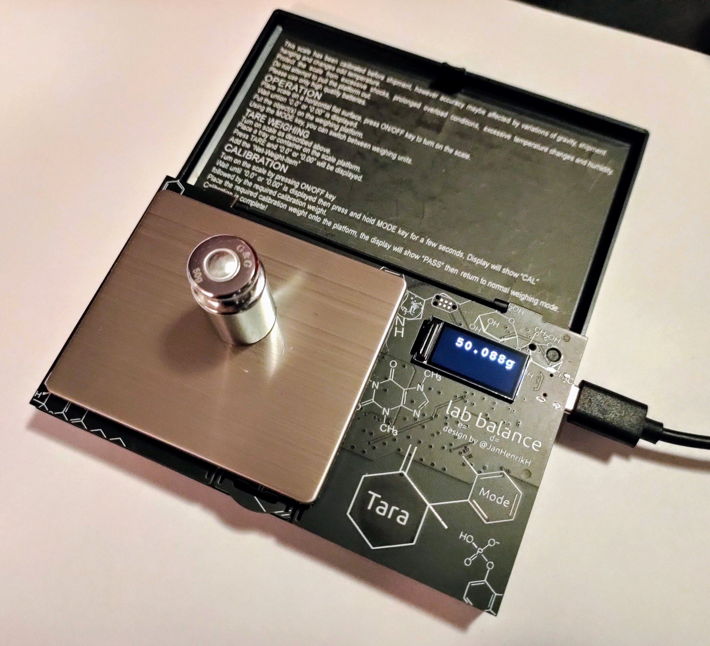
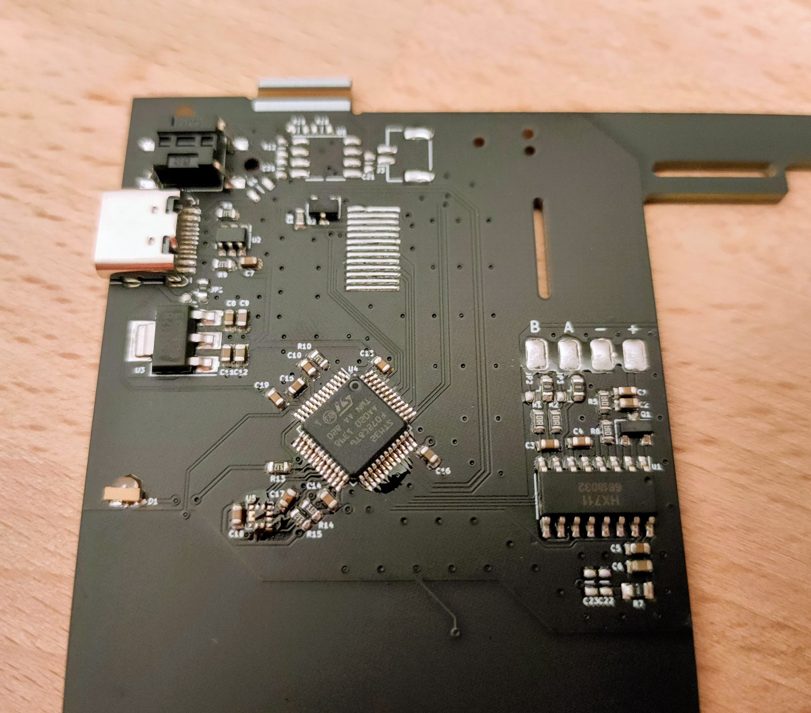
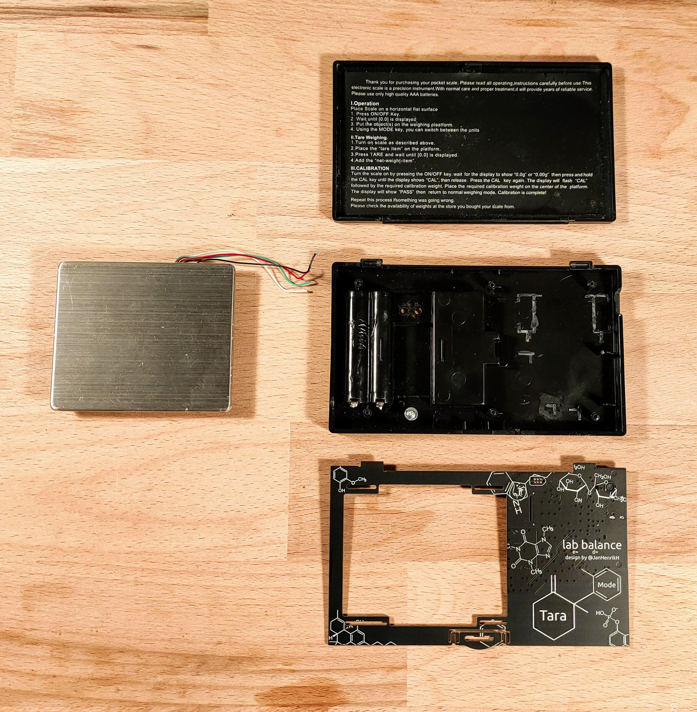

# lab-balance

This project aims to replace the electronics contained within a cheap scale from AliExpress to archive a higher resolution and hackability. Furthermore I need a scale which does not turn off after 30 seconds of use!

The goal is not met so far, as the accuracy of the load cell is not sufficient for this task. It can be replaced with a higher end model.

